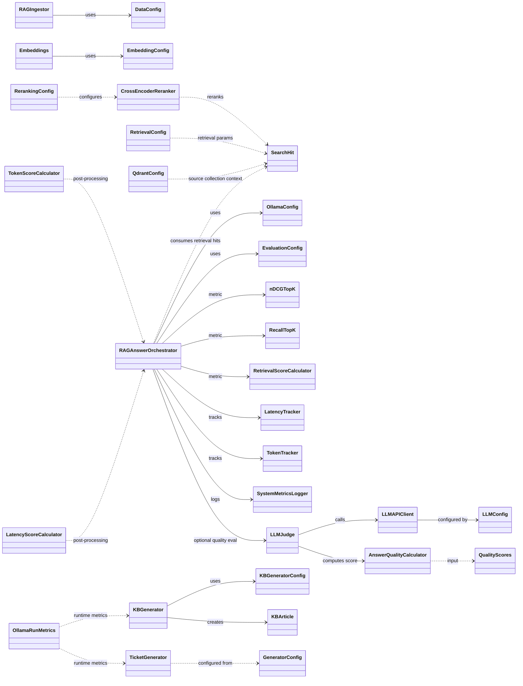

# Klassendiagramm der Anwendung (src/rag_csv)

Hinweis: In diesem Workspace existiert der Pfad `src/rag` nicht. Das Diagramm basiert daher auf den Klassen unter `src/rag_csv`.

## Lesart

- Durchgezogene Pfeile (`-->`) zeigen direkte Nutzung oder Aggregation.
- Gestrichelte Pfeile (`..>`) zeigen lose Abhängigkeiten oder indirekte Kopplung.
- `RAGAnswerOrchestrator` ist die zentrale Klasse für den Evaluations-Flow.
- `RAGIngestor` deckt den Ingestion-Flow ab, `CrossEncoderReranker` erweitert den Retrieval-Teil optional.
