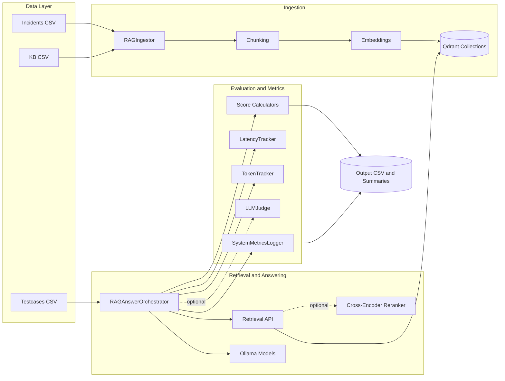

# Vereinfachte Architekturansicht

Kurzbeschreibung:
- Links liegen die Datenquellen, in der Mitte die Laufzeitkomponenten, rechts die Auswertung.
- Qdrant ist das gemeinsame Bindeglied zwischen Ingestion und Retrieval.
- Der Orchestrator verbindet Retrieval, Modellaufruf und Metrikberechnung.
