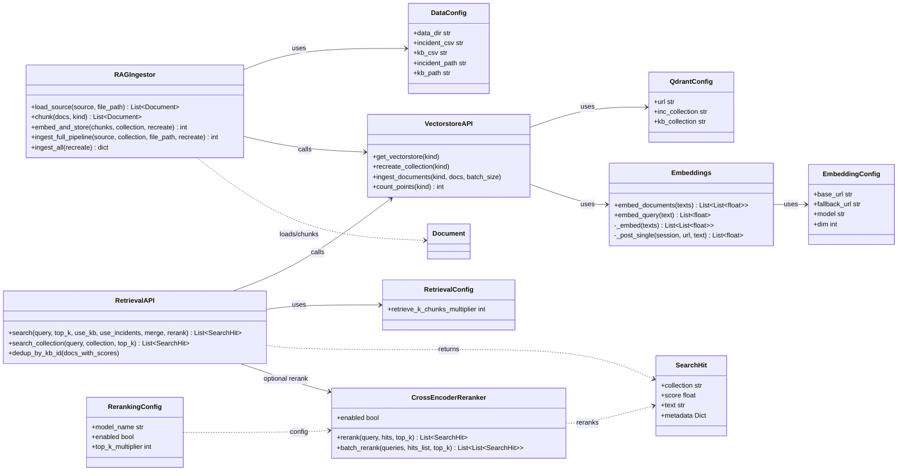

# Detailliertes Diagramm: Retrieval und Ingestion

Kurzbeschreibung:
- Der Ingestion-Flow liegt in RAGIngestor und delegiert Speicherung/Embeddings an die Vectorstore-Ebene.
- Der Retrieval-Flow nutzt SearchHit als einheitliches Ergebnisobjekt.
- Reranking ist optional und wird auf die vorselektierten Treffer angewendet.
