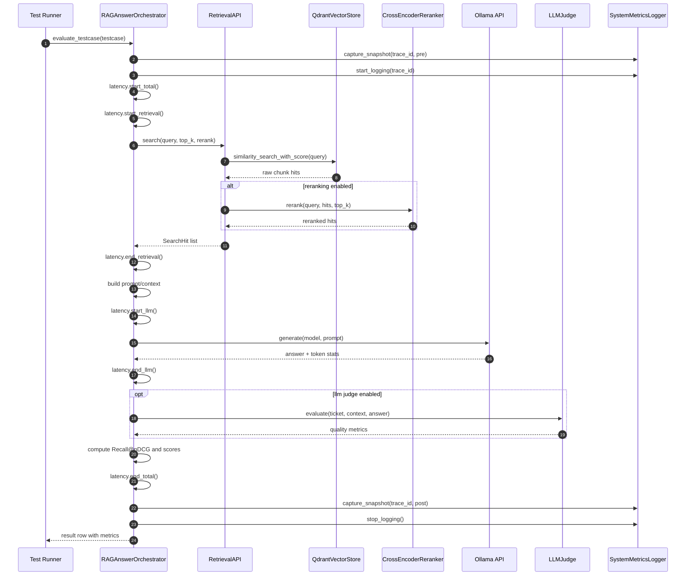

# Sequenzdiagramm: Lauf eines Testfalls

Kurzbeschreibung:
- Der Orchestrator ist der zentrale Ablaufknoten.
- Retrieval und LLM-Aufruf werden separat in der Latenz gemessen.
- Monitoring (pre/continuous/post) ist über die Trace-ID mit dem Testfall korreliert.
